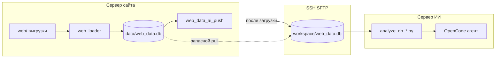

# Синхронизация `web_data.db` с сервера сайта

## Задача

Сайт (bi-analytics) при загрузке `web/` пишет SQLite **`data/web_data.db`**.  
ИИ (OpenCode + `analyze_db_*.py`) читает **`workspace/web_data.db`**.

Чтобы ответы были по актуальным данным, файл с **сервера сайта** нужно попадать на **сервер/ПК с ИИ**.

Рекомендуется **push с сайта сразу после загрузки** (`AI_PUSH_ENABLED=true`, модуль `web_data_ai_push.py` в bi-analytics).  
Запасной вариант — **pull с сервера ИИ** по cron (`scripts/sync_web_data_db.py`).

Это **не** тот же туннель, что для OpenCode HTTP (порт 4096). Для БД — **передача файла** по SSH (SFTP).

---

## Где лежит БД

| Среда | Типичный путь |
|--------|----------------|
| Сайт (bi-analytics) | `<корень_сайта>/data/web_data.db` |
| Переменная на сайте | `WEB_DB_PATH` (см. `web_schema.py`) |
| ИИ (этот репозиторий) | `workspace/web_data.db` |
| ИИ в Docker | `/workspace/web_data.db` (volume `./workspace`) |

Уточните на сервере сайта:

```bash
# на сервере сайта, в каталоге проекта
python -c "from web_schema import WEB_DB_PATH; print(WEB_DB_PATH)"
# или
ls -la data/web_data.db
```

---

## Варианты (от простого к надёжному)

### 1. Один сервер (сайт и ИИ на одной машине)

Туннель не нужен. Достаточно **общего файла**:

- symlink: `opencode_web/workspace/web_data.db` → `bi-analytics/data/web_data.db`
- или один volume в Docker для обоих контейнеров

Самый простой и всегда актуальный вариант.

### 2. Два сервера — ручной SCP

```bash
scp user@SITE_HOST:/path/to/bi-analytics/data/web_data.db \
    ./workspace/web_data.db.tmp
mv ./workspace/web_data.db.tmp ./workspace/web_data.db
```

После каждой загрузки данных на сайте — повторить копирование.

### 3. Два сервера — push с сайта после загрузки (рекомендуется)

На **сервере сайта** (bi-analytics), в `.env` или secrets:

```env
AI_PUSH_ENABLED=true
PUSH_SSH_HOST=<IP_сервера_ИИ>
PUSH_SSH_USER=<user>
PUSH_SSH_PASSWORD=<password>
PUSH_SSH_PORT=22
PUSH_REMOTE_WEB_DB_PATH=/home/app/opencode_web/workspace/web_data.db
# опционально: консистентный снимок перед отправкой
PUSH_USE_LOCAL_BACKUP=true
# если рядом лежит репозиторий opencode_web:
OPENCODE_WEB_ROOT=/home/app/opencode_web
```

После каждого успешного `load_all_from_web()` файл `data/web_data.db` уходит на ИИ (атомарно: `.upload.tmp` → rename).

На сервере сайта: `pip install 'paramiko>=3.4,<4'` (если не используете `OPENCODE_WEB_ROOT`).

Ручной push с машины сайта:

```bash
python /path/to/opencode_web/scripts/push_web_data_to_ai.py
```

### 4. Два сервера — pull с сервера ИИ (запасной)

Скрипт **`scripts/sync_web_data_db.py`** (`SYNC_SSH_*` / `AI_SSH_*` — хост **сайта**, куда подключается ИИ):

```bash
python scripts/sync_web_data_db.py
```

Планировщик (Linux cron на сервере ИИ, каждые 15 мин):

```cron
*/15 * * * * cd /path/to/opencode_web && /path/to/venv/bin/python scripts/sync_web_data_db.py >> logs/sync_web_data.log 2>&1
```

Windows — Task Scheduler с той же командой.

### 5. rsync (если установлен OpenSSH/rsync)

```bash
rsync -avz --progress user@SITE_HOST:/path/to/data/web_data.db workspace/web_data.db
```

Флаг `-avz` сохраняет время модификации; скрипт Python сравнивает `mtime` и размер и пропускает лишние копии.

---

## Важно для SQLite

1. **Копировать целиком один файл** — нормально, если в момент копии сайт **не пишет** в БД (пауза после `load_all_from_web`) или копия через `.backup` на сервере.
2. Скрипт по умолчанию тянет **`web_data.db`**; при `SYNC_USE_REMOTE_BACKUP=true` на сервере сначала создаётся консистентный снимок `web_data.sync-copy.db`.
3. Локально: загрузка во **`.tmp`**, затем атомарная замена — чат не видит «битый» файл наполовину.
4. После синка перезапуск Streamlit/OpenCode **не обязателен** — следующий запрос `analyze_db_*.py` увидит новый файл.

---

## Переменные `.env` (дополнение)

**Push (сайт → ИИ):**

```env
AI_PUSH_ENABLED=true
PUSH_SSH_HOST=
PUSH_SSH_USER=
PUSH_SSH_PASSWORD=
PUSH_REMOTE_WEB_DB_PATH=/home/app/opencode_web/workspace/web_data.db
PUSH_USE_LOCAL_BACKUP=false
```

**Pull (ИИ ← сайт):**

```env
# Путь к БД на сервере сайта (обязательно уточнить!)
SYNC_REMOTE_WEB_DB_PATH=/home/app/bi-analytics/data/web_data.db

# Куда класть локально (по умолчанию workspace/web_data.db)
SYNC_LOCAL_WEB_DB_PATH=

# Сначала снимок .backup на сервере (безопаснее при активной записи)
SYNC_USE_REMOTE_BACKUP=false

# Не качать, если размер+mtime не изменились
SYNC_SKIP_IF_UNCHANGED=true
```

Используются те же **`AI_SSH_HOST`**, **`AI_SSH_USER`**, **`AI_SSH_PASSWORD`**, **`AI_SSH_PORT`**, что для туннеля OpenCode (можно задать отдельные `SYNC_SSH_*`, если сайт на другом хосте).

---

## Схема



---

## Чего не делать

- Не полагаться только на SSH-туннель к OpenCode — он **не** отдаёт файлы диска.
- Не коммитить `web_data.db` в git (уже в `.gitignore`).
- Не копировать во время долгой записи без backup — риск повреждённой SQLite.

---

## Проверка после синка

```bash
python workspace/analytics/inspect_web_db.py --db workspace/web_data.db
```

В Streamlit-чате задайте вопрос с цифрами — агент должен увидеть тот же `version_id`, что на сайте (в `web_versions`, `is_active=1`).
